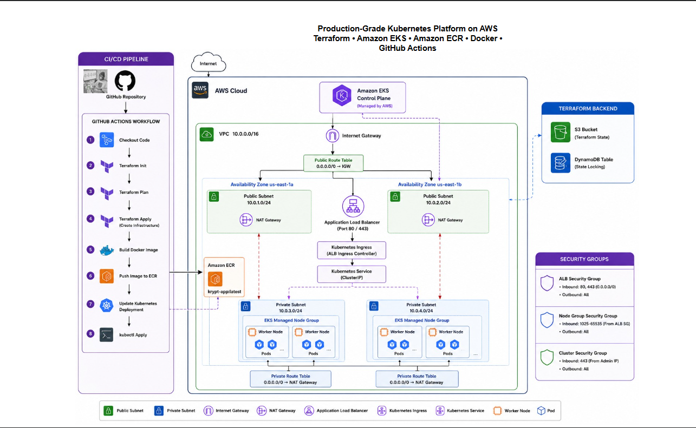

# Terraform AWS EKS Platform

## Overview

Terraform AWS EKS Platform is a production-style cloud infrastructure project built to demonstrate Infrastructure as Code (IaC), container orchestration, CI/CD automation, and Kubernetes deployment on AWS.

The platform provisions a complete Amazon EKS environment using modular Terraform architecture, deploys a containerized TypeScript application through GitHub Actions, stores container images in Amazon ECR, and exposes workloads through an Application Load Balancer.

This project was designed to simulate a real-world DevOps deployment workflow where infrastructure provisioning and application delivery are fully automated.

---

# Architecture

The platform consists of:

* Amazon VPC
* Public and Private Subnets
* Internet Gateway
* NAT Gateway
* Route Tables
* Security Groups
* Amazon EKS Cluster
* Managed Node Groups
* Amazon ECR Repository
* GitHub Actions CI/CD Pipeline
* Docker Containerization
* Kubernetes Deployments
* Kubernetes Services
* Kubernetes Ingress
* Application Load Balancer

### High-Level Flow

```text
Developer Push
        │
        ▼
GitHub Actions
        │
        ├── Terraform Infrastructure Deployment
        │
        ▼
Amazon ECR
        │
        ▼
Amazon EKS
        │
        ▼
Kubernetes Pods
        │
        ▼
Application Load Balancer
        │
        ▼
Users
```

---

# Architecture Diagram



---

# Technology Stack

## Cloud

* AWS VPC
* AWS EKS
* AWS ECR
* AWS IAM
* AWS Internet Gateway
* AWS NAT Gateway
* AWS Route Tables
* AWS Security Groups

## Infrastructure as Code

* Terraform

## Containerization

* Docker

## Orchestration

* Kubernetes
* Amazon EKS

## CI/CD

* GitHub Actions

## Application

* TypeScript
* Node.js

---

# Project Structure

```text
terraform-aws-eks-platform/
│
├── .github/
│   └── workflows/
│       └── terraform.yml
│
├── app/
│   ├── src/
│   │   └── index.ts
│   ├── Dockerfile
│   └── package.json
│
├── kubernetes/
│   ├── deployment.yaml
│   ├── service.yaml
│   └── ingress.yaml
│
├── modules/
│   ├── vpc/
│   ├── subnets/
│   ├── igw/
│   ├── nat/
│   ├── route-tables/
│   ├── security-groups/
│   ├── iam/
│   ├── ecr/
│   ├── eks/
│   └── nodegroup/
│
├── diagrams/
│
├── variables/
│   └── dev.tfvars
│
├── main.tf
├── variables.tf
├── outputs.tf
└── providers.tf
```

---

# Infrastructure Components

## VPC

A dedicated Virtual Private Cloud provides network isolation for all platform resources.

```text
CIDR Block: 10.0.0.0/16
```

---

## Public Subnets

Public subnets host:

* NAT Gateway
* Application Load Balancer

```text
10.0.1.0/24
10.0.2.0/24
```

---

## Private Subnets

Private subnets host:

* EKS Worker Nodes
* Kubernetes Pods

```text
10.0.3.0/24
10.0.4.0/24
```


## Internet Gateway

Provides internet connectivity to public resources.


## NAT Gateway

Allows private resources to reach external services without exposing them directly to the internet.


## Security Groups

Security groups control network access between:

* Application Load Balancer
* EKS Worker Nodes
* Kubernetes Workloads


## Amazon EKS

Amazon Elastic Kubernetes Service provides managed Kubernetes control plane services.

Features:

* Multi-AZ deployment
* Managed node groups
* IAM integration
* Load balancer integration


## Amazon ECR

Amazon Elastic Container Registry stores Docker images generated during CI/CD execution.

Repository Example:

```text
dev-my-kubernetes-app
```


# Sample Application

A lightweight TypeScript application was created to validate the deployment pipeline.

The application exists solely to provide a deployable container workload for EKS.

## Source Code

```typescript
console.log(
  "Hello from Kryptcloud Platform! EKS is ready to run this container."
);
```


# Docker Containerization

The TypeScript application is packaged into a Docker image.

## Build

```bash
docker build -t krypt-app .
```

## Tag

```bash
docker tag krypt-app:latest <ecr-uri>:latest
```

## Push

```bash
docker push <ecr-uri>:latest
```


# Kubernetes Deployment

The platform deploys the application into Amazon EKS using:

### Deployment

```text
deployment.yaml
```

Responsible for:

* Pod creation
* Replica management
* Rolling updates

### Service

```text
service.yaml
```

Responsible for:

* Internal traffic routing
* Pod discovery

### Ingress

```text
ingress.yaml
```

Responsible for:

* External access
* ALB integration
* HTTP routing


# CI/CD Pipeline

The GitHub Actions workflow is divided into two stages.

## Stage 1: Infrastructure Deployment

Terraform provisions all AWS resources.

### Workflow

```text
Checkout Code
      │
Terraform Init
      │
Terraform Validate
      │
Terraform Plan
      │
Terraform Apply
```

---

## Stage 2: Application Deployment

Application delivery begins only after infrastructure deployment succeeds.

### Workflow

```text
Checkout Code
      │
Build Docker Image
      │
Push Image To ECR
      │
Update Kubernetes Manifest
      │
kubectl Apply
```

---

# Dynamic Image Versioning

Container images are versioned automatically using Git commit hashes.

Kubernetes manifests use a placeholder image reference:

```yaml
image: IMAGE_PLACEHOLDER
```

GitHub Actions replaces the placeholder during deployment:

```bash
sed -i "s|IMAGE_PLACEHOLDER|${IMAGE_URI}|g" kubernetes/deployment.yaml
```

This guarantees that each deployment uses the exact image produced by the current pipeline execution.

---

# Problems Encountered & Resolutions

## Variable Alignment and Cyclic Dependencies

### Issue

Terraform modules referenced inconsistent variable names:

```text
var.igw_id
```

while the root module declared:

```text
internet_gateway_id
```

The Internet Gateway module also attempted to reference its own output, creating a cyclic dependency.

### Resolution

* Standardized variable names
* Removed self-referencing assignments
* Removed unnecessary IGW input variables

---

## Missing Variables File

### Issue

Terraform failed to locate:

```text
dev.tfvars
```

and requested manual input.

### Resolution

The variables file was located inside a nested directory.

Execution was updated to:

```bash
terraform plan -var-file="variables/dev.tfvars"
```

---

## Module Output Type Errors

### Issue

Terraform produced:

```text
string required, but have object
```

because entire resource objects were exported instead of IDs.

### Resolution

Updated outputs to return resource IDs.

Example:

```terraform
output "vpc_id" {
  value = aws_vpc.main.id
}
```

---

## CI/CD Pipeline Refactoring

### Issue

Infrastructure deployment and application deployment existed in a single workflow job.

Troubleshooting and visibility became difficult.

### Resolution

Workflow redesigned into two independent stages using:

```yaml
needs:
```

This established a clear dependency chain between infrastructure provisioning and application deployment.


# Validation

The platform was successfully validated through:

* Terraform deployment success
* EKS cluster creation
* Node group registration
* ECR image storage
* Docker image builds
* Kubernetes deployments
* GitHub Actions automation
* Application Load Balancer integration


# Screenshots

## Architecture Diagram

Insert architecture diagram here.


## GitHub Actions Pipeline

Insert successful workflow execution screenshot here.


## Amazon EKS Cluster

Insert EKS cluster screenshot here.


## Amazon ECR Repository

Insert ECR repository screenshot here.


## Running Kubernetes Pods

Insert kubectl get pods screenshot here.


# Skills Demonstrated

* Infrastructure as Code (Terraform)
* AWS Networking
* Amazon VPC Design
* Amazon EKS Administration
* Amazon ECR Management
* Docker Containerization
* Kubernetes Workloads
* Kubernetes Networking
* GitHub Actions CI/CD
* Modular Terraform Design
* IAM Configuration
* Route Table Management
* Security Group Design
* Infrastructure Troubleshooting
* Production Deployment Workflows


# Author#

**Fidelis Adibe(kryptcloud)**

DevOps Engineer | Cloud Infrastructure Engineer

Focused on building scalable cloud platforms using AWS, Terraform, Kubernetes, Docker, GitHub Actions, and Infrastructure as Code principles.
